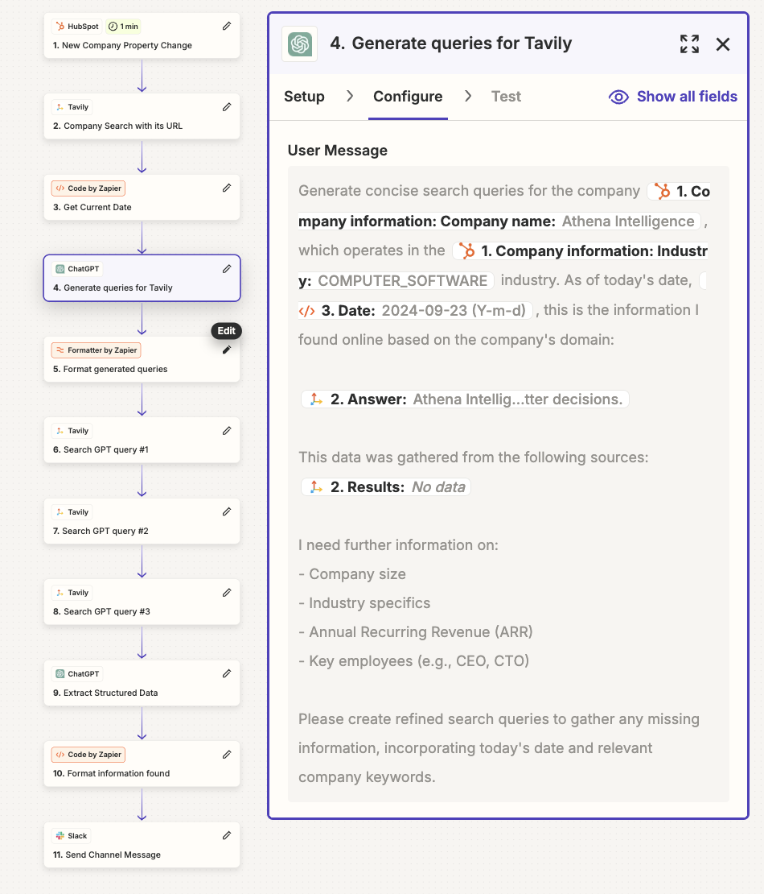

# Zapier

We're thrilled to announce that **Tavily** is now available for **no-code** integration through **Zapier**, enabling seamless automation and real-time information retrieval for your workflows! 🚀

No need to write a single line of code to connect Tavily to your business processes. With Tavily's robust search capabilities, you can pull in the latest online information into any application or workflow. Simply set up [**Tavily in Zapier**](https://zapier.com/apps/tavily/integrations) to automate research, track real-time news, or feed relevant data into your tools of choice.

## How to Use Tavily API with Zapier

1. **Log in to Zapier** 
2. **Create a Zap** and **select a trigger event**.
3. **Add an action step with Tavily** in your workflow:
   - **Setup**: Connect your Tavily account by pasting your API key.
   - **Configure**: Enter your search query along with optional parameters, such as selecting a topic (general or news), deciding whether to include raw content from the sources or an answer based on the content found, and specifying particular domains to run the search on
   - **Test**: Test your query
4. **Use the 'results' and optionally the 'answer' generated by Tavily** in the rest of your workflow, such as:
   - Sending up-to-date research to your CRM
   - Feeding real-time content into your language model (e.g., GPT models) for additional applications
   - Inserting dynamic info into an email automation tool

## Use Cases for Tavily with Zapier

### Tavily + AI Models for Contextual Intelligence (RAG) 
Integrate up-to-date information seamlessly into language models like **OpenAI** or **Anthropic** for real-time reliable context generation. Whether you're automating support tickets, crafting summaries, or creating personalized customer insights, Tavily ensures your AI models have the latest information at their fingertips.

- **Automated Email Generation**: Use Tavily to create tailored emails based on real-time data
  
- **Meeting Preparation**: Gather real-time information about meeting participants. For instance, before a client meeting, retrieve their latest news or social media updates and receive a concise summary through your preferred method, ensuring you’re well-informed

- **Automated Reporting**: Utilize Tavily’s online search data to generate reports. Push this information into tools like **Google Sheets**, **Notion**, or **Slack** to create a weekly digest of industry trends or competitor analysis, keeping your team updated effortlessly

These use cases illustrate how Tavily can enhance workflows and decision-making processes across various applications.

## Tips

- Create concise queries for Tavily, and if needed, create multiple Tavily steps
- If up-to-date news information is required, configure "news" as your topic
- Add the current date to your queries for relevant, updated information
- Consider using specific domains to narrow down search results
- Use an LLM to generate queries for Tavily to enable a more agentic workflow

## Example: Execute Brief Company Research for Newly Signed-Up Companies with Tavily and Deliver the Report via Slack

**Workflow Steps**:
1. **Trigger Event**: A new company is created in your CRM.
2. **Conduct Company Search**: Use Tavily to perform a general search using the company's domain (provided by the CRM).
3. **Retrieve Current Date**: Capture the current date and pass it to the LLM in the next step.
4. **Generate Search Queries**: Request the LLM to create 3 concise search queries for Tavily to obtain additional information about the company (e.g., industry, ARR, CEO, CTO). Include the previously gathered data from the company website as context to prevent redundancy. Ask the LLM to incorporate important keywords related to the company to avoid retrieving information about a different company with the same name but in a different industry or domain.
5. **Organize Queries**: Format the generated queries into separate fields for use in distinct steps.
6. **Configure Queries**: Set up the 3 queries in Tavily across 3 individual steps.
7. **Extract Structured Data**: Instruct the LLM to fill in specific details about the company from the gathered data and indicate the sources used for verification. Additionally, instruct the LLM to use the sources extracted from the domain as the ground truth.
8. **Refine Information**: Format the information for clarity and professionalism.
9. **Send to Slack**: Deliver the final message to Slack for easy access and sharing.

## Getting Started

Simply sign up for [**Zapier**](https://zapier.com/app/home) and [**Tavily**](https://app.tavily.com/sign-in) and create your first automated workflow in minutes. You can start integrating Tavily into your daily processes to ensure you're always working with the most current, reliable information from across the web!

We’re excited to see what you build on Zapier with our integration! Don’t hesitate to visit our [Developer Community](https://community.tavily.com) or reach out at [support@tavily.com](mailto:support@tavily.com) for any questions related to this integration.
