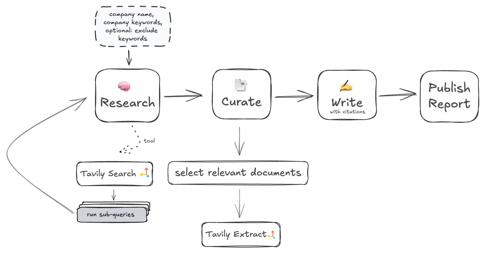

# Tavily API for  Company Research

## 💡 Why Use Tavily API for Company Research?

Tavily API offers several advantages for conducting in-depth company research:

1. **Comprehensive Data Gathering**: Tavily's advanced search algorithms pull relevant information from a wide range of online sources, providing a robust foundation for in-depth company research. 

2. **Flexible Agentic Search**: When Tavily is integrated into agentic workflows, such as those powered by frameworks like LangGraph, it allows AI agents to dynamically tailor their search strategies. The agents can decide to perform either a news or general search depending on the context, retrieve raw content for more in-depth analysis, or simply pull summaries when high-level insights are sufficient. This adaptability ensures that the research process is optimized according to the specific requirements of the task and the nature of the data available, bringing a new level of autonomy and intelligence to the research process.

3. **Real-time Data Retrieval**: Tavily ensures that the data used for research is up-to-date by querying live sources. This is crucial for company research where timely information can impact the accuracy and relevance of the analysis.

4. **Efficient and Scalable**: Tavily handles multiple queries simultaneously, making it capable of processing large datasets quickly. This efficiency reduces the time needed for comprehensive research, allowing for faster decision-making.

## Example Jupyter Notebook Overview

The following [Jupyter Notebook](https://github.com/tavily-ai/use-cases/blob/main/company-research/company_research.ipynb) demonstrates how to run weekly research process on companies using Tavily API, LangGraph framework, and OpenAI for content generation. This notebook outlines a comprehensive workflow that dynamically gathers relevant information on a company, processes the data, and generates a detailed PDF report.



### Workflow Overview

The notebook utilizes several components to achieve its goal through a structured set of nodes representing different stages of the research process:

1. **ResearchState Setup**:
   - The `ResearchState` data structure manages the company's name, keywords, documents retrieved during research, and messages exchanged during the process. This state keeps track of all necessary data throughout the workflow.

   ```python
   class ResearchState(TypedDict):
       company: str
       company_keywords: str
       exclude_keywords: str
       report: str
       documents: Dict[str, Dict[Union[str, int], Union[str, float]]]
       RAG_docs: Dict[str, Dict[Union[str, int], Union[str, float]]]
       messages: Annotated[list[AnyMessage], add_messages]
   ```

2. **Research and Tool Nodes**

- In the **research** step, the workflow initiates the information-gathering process using the `research_model` function. The function leverages OpenAI as the base model for analyzing and generating insights about the company's latest developments.  It also determines the next course of action in the workflow. Depending on the information gathered so far, the model decides whether to continue executing the **Tavily Search tool** to gather more data or to proceed to curating the gathered documents using **Tavily Extract**. This decision-making capability is what makes the workflow agentic, allowing it to dynamically adapt to the specific research needs and ensure that the most relevant and comprehensive information is included in the final output.

- The `should_continue` function is used to determine whether tools should be executed or if the process should move on to the next phase (i.e., curation).

- **Tavily Search API tool:** The `TavilyQuery` and `TavilySearchInput` classes facilitate detailed and efficient searches with the Tavily Search API. Within an agentic workflow, the agent leverages the Tavily Search API to determine which queries to execute and under what conditions. 
  - By appending the current date to the query (e.g., `query_with_date = f"{itm.query} {datetime.now().strftime('%m-%Y')}"`), the agent ensures that the data retrieved by Tavily is current and pertinent.

- The `tool_node` processes the retrieved data into a dictionary so it can be easily accessible for further evaluation.

```python
# Invoke the model to gather data about the company and decide whether to continue invoking the Tavily Search tool
def research_model(state: ResearchState):
    prompt = f"""Today's date is {datetime.now().strftime('%d/%m/%Y')}.\n
    You are an expert researcher tasked with gathering information for a weekly report on recent developments in portfolio companies.\n
    Your current objective is to gather documents about any significant events that occurred in the past week for the following company: {state['company']}.\n
    The user has provided the following company keywords: {state['company_keywords']} to help you find relevant documents.\n
    **Instructions:**\n
    - Use the 'tavily_search' tool to search for relevant documents
    - Focus on gathering documents by making appropriate tool calls
    - If you believe you have gathered enough information, state 'I have gathered enough information and am ready to proceed.'
    """
    messages = state['messages'] + [SystemMessage(content=prompt)]
    # ...
    response = model.bind_tools(tools).invoke(messages)
    return {"messages": [response]}
```

```python
# Define the function to determine the next step in the workflow
def should_continue(state: ResearchState) -> Literal["tools", "curate"]:
    last_message = state['messages'][-1]
    # If tool calls exist, continue with tools
    if last_message.tool_calls:
        return "tools"
    # Otherwise, proceed to curation
    return "curate"
```

```python
# Define the structure for Tavily search inputs

# Add Tavily's arguments to enhance the web search tool's capabilities
class TavilyQuery(BaseModel):
    query: str = Field(description="web search query")
    topic: str = Field(description="type of search, should be 'general' or 'news'. Choose 'news' ONLY when the company you searching is publicly traded and is likely to be featured on popular news")
    days: int = Field(description="number of days back to run 'news' search")
    domains: Optional[List[str]] = Field(default=None, description="list of domains to include in the research. Useful when trying to gather information from trusted and relevant domains")
 
class TavilySearchInput(BaseModel):
    sub_queries: List[TavilyQuery] = Field(description="set of sub-queries that can be answered in isolation")

# Tavily search tool for performing searches concurrently
@tool("tavily_search", args_schema=TavilySearchInput, return_direct=True)
async def tavily_search(sub_queries: List[TavilyQuery]):
    """Perform searches for each sub-query using the Tavily search tool concurrently."""  
    async def perform_search(itm):
        try:
            # Construct query with date for the most recent results
            query_with_date = f"{itm.query} {datetime.now().strftime('%m-%Y')}"
            response = await tavily_client.search(query=query_with_date, topic=itm.topic, days=itm.days, max_results=10)
            return response['results']
        except Exception as e:
            # Handle exceptions
            print(f"Error occurred during search for query '{itm.query}': {str(e)}")
            return []

    # Run all search tasks concurrently
    search_tasks = [perform_search(itm) for itm in sub_queries]
    search_responses = await asyncio.gather(*search_tasks)

    # Combine results
    # ...

    return search_results
```

```python
# Tool node for processing Tavily's search results
async def tool_node(state: ResearchState):
    docs = state.get('documents', {})
    msgs = []
    for tool_call in state["messages"][-1].tool_calls:
        tool = tools_by_name[tool_call["name"]]
        new_docs = await tool.ainvoke(tool_call["args"])
        # Store only new documents
        for doc in new_docs:
            if not docs or doc['url'] not in docs:
                docs[doc['url']] = doc
                # ...
        msgs.append(ToolMessage(content="Found the following new documents/information...", tool_call_id=tool_call["id"]))
    return {"messages": msgs, "documents": docs}
```

3. **Curate Node**:
   - In the **curate** step, the workflow selects the most relevant documents from the data retrieved. This involves reviewing documents, applying keyword matching, and retrieving raw content to ensure a focused dataset.

   ```python
   async def select_and_process(state: ResearchState):
    prompt = f"""You are an expert researcher..."""
    if state['exclude_keywords'] != "":
        prompt += f"""Additionally, exclude the following keywords..."""
    prompt += f"""\nHere is the list of documents..."""
    # ...
    # Use the model to filter documents
    relevant_urls = model.with_structured_output(TavilyExtractInput).invoke(messages)
        
    try:
        # Extract raw content from selected URLs
        response = await tavily_client.extract(urls=relevant_urls.urls)
        # ...
    except Exception as e:
        print(f"Error occurred during Tavily Extract request: {str(e)}")
    # ...
    return {"messages": [AIMessage(content=msg)], "RAG_docs": RAG_docs}
    ```

4. **Write Node**:
   - The **write** step involves generating the weekly report based on the curated documents using OpenAI, ensuring that the report is detailed and well-cited.

   ```python
   def write_report(state: ResearchState):
       prompt = f"""Today's date is {datetime.now().strftime('%d/%m/%Y')}.
       You are an expert researcher, writing a weekly report..."""
       response = model.with_structured_output(QuotedAnswer).invoke(messages)
       full_report = response.answer
       full_report += "\n\n### Citations\n"
       # Append citations
       return {"messages": [AIMessage(content=f"Generated Report:\n{full_report}")], "report": full_report}
   ```

5. **Publish Node**:
   - In the **publish** step, the generated report is converted into a PDF document for easy sharing and presentation.

   ```python
   def generate_pdf(state: ResearchState):
       directory = "reports"
       file_name = f"{state['company']} Weekly Report..."
       msg = generate_pdf_from_md(state['report'], filename=f'{directory}/{file_name}.pdf')
       return {"messages": [AIMessage(content=msg)]}
   ```

### Conclusion

This notebook demonstrates a structured approach to automating company research using the Tavily API, LangGraph Agents, and OpenAI for content generation. By leveraging a multi-query strategy, document filtering techniques, and targeted extraction of relevant information from selected documents, the workflow ensures efficient and accurate data processing. The agentic workflow, with its dynamic decision-making capabilities, allows for adaptability to specific research requirements, resulting in well-informed and well-cited company reports. This makes it a powerful tool for continuous and reliable company analysis.

You can view examples of company reports generated by the code in the notebook [here](https://github.com/tavily-ai/use-cases/tree/main/company-research/reports).

## Possible Improvements

1. **Advanced Content Generation Filtering:** Enhance the workflow by incorporating more advanced filtering techniques, such as selecting the top K most relevant documents using relevance scoring or similarity measures. This pre-content generation filtering step, combined with keyword-based filtering, ensures that only the most pertinent information is used, allowing the content generation step to focus solely on producing high-quality, accurate reports without the burden of additional filtering.

2. **"Human on the Loop" Feedback Integration:** Allow a human to provide feedback on the sources found during research and guide the agent to retrieve the most relevant sources. Instead of predefining keywords before the execution of the process, enable the dynamic inclusion or exclusion of keywords and other adjustments that only a human can provide when needed, improving the user experience as well as the quality and accuracy of the sources used.

3. **Advanced Curation Step:** Instead of adding raw content to the RAG documents, include only the relevant information extracted from the raw text. This can be achieved through live chunking or using an LLM to extract or summarize the pertinent information, ensuring that the content fed into the generation step is highly focused and relevant.

4. **Customized Workflow for Specific Needs:** Tailor the workflow to meet specific requirements by defining a precise report format or prioritizing the use of particular sources. For instance, you can specify that only certain trusted domains should be used for data retrieval or create a structured template that the generated reports must follow. This customization enhances the relevance and precision of the research output, ensuring it aligns closely with your unique needs.
