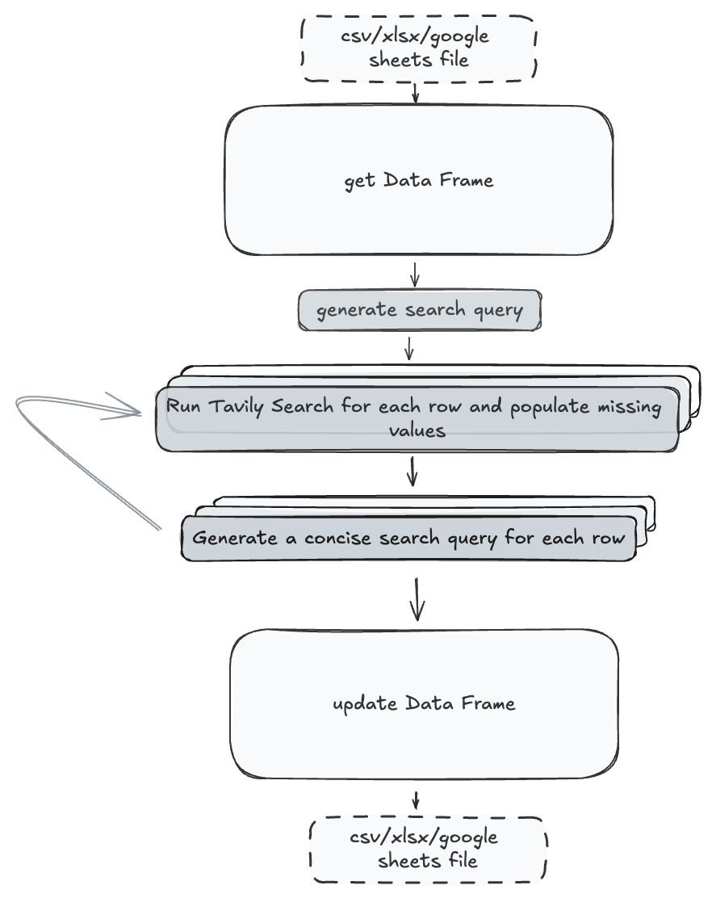

# Tavily API for Data Enrichment

## 💡 Why Use Tavily API for Data Enrichment?

Tavily API offers several advantages for enhancing datasets:

1. **Advanced Search Capabilities**: Tavily utilizes advanced search algorithms to gather relevant information from various online sources, making it ideal for filling in missing data points.

2. **Real-time Data Retrieval**: By querying live sources, Tavily ensures that the data used for enrichment is up-to-date and relevant.

3. **Scalable and Efficient**: Tavily can handle multiple queries simultaneously, allowing you to process large datasets efficiently and reduce overall execution time.

## Example Jupyter Notebook Overview

The following [Jupyter Notebook](https://github.com/tavily-ai/use-cases/blob/main/data-enrichment/data_enrichment_agent.ipynb) illustrates how to build an AI agent that leverages the Tavily API for data enrichment.

The system employs the LangGraph Framework to orchestrate the workflow, managing two agents: a Data Agent and an Enrich Agent. The Data Agent is responsible for retrieving, processing, and loading data into a DataFrame, as well as saving the enriched data in various formats, such as CSV, Excel, or Google Sheets. Meanwhile, the Enrich Agent automates the process of filling in missing data within the dataset. It utilizes Tavily's search capabilities to collect relevant information from the web and employs an OpenAI model to generate search queries and extract the necessary data points. The use of asynchronous tasks allows multiple rows to be processed concurrently, increasing the efficiency of the data enrichment process.



[//]: # (<div align="center">)

[//]: # ()
[//]: # ()

[//]: # ()
[//]: # (</div>)

### Overview of the Enrich Agent Class

Below is a partial implementation of the `EnrichAgent` class, highlighting its key components without showing all the internal details:

```python
class EnrichAgent():
    def __init__(self):
        # Initialize settings
        self.MAX_COLS_PER_PASS = 5
        self.MAX_PASSES = 5
        self.model = ChatOpenAI(model="gpt-4o", temperature=0)

    def is_missing_value(self, value):
        """
        Check if a value is considered missing.
        """
        ...

    async def generate_search_query(self, head, columns):
        """
        Generate a search query for missing columns.
        """
        prompt = f"""You are a researcher with the task of filling in a spreadsheet...
        """
        response = await self.model.ainvoke(messages)
        return response.content.strip('\'"')

    async def fill_in_row(self, df, head, row_index, columns, search_query):
        """
        Call Tavily API to retrieve information using the search_query and prompt OpenAI to extract column values from the response
        """
        entry = str(df.iloc[row_index][head[0]])
        ...
        # Process Tavily API response
        ...

    async def run(self, state: AgentState):
        """
        Main function to for running the Enrichment Process
        """
        df = state['raw_data'].copy()
        ...
        # Loop through rows and apply enrichment
        ...

``` 
- ```MAX_COLS_PER_PASS```: This sets the maximum number of columns that the agent will try to fill in during a single operation, which can help in managing the complexity of the data retrieval and processing tasks.
- ```MAX_PASSES```: This defines the maximum number of attempts the agent will make to fill in missing data across the dataset. By setting a limit, the agent avoids getting stuck in endless loops if the data cannot be fully retrieved.
- ```generate_search_query```: This function generates a search query tailored to fill in specific missing columns. It constructs a prompt using the column headers and fields that need data, and then uses the OpenAI model to generate a suitable search query. This query is used to interact with the Tavily API for data retrieval.
- ```fill_in_row```: This function attempts to fill in the missing data for a given row in the DataFrame. It constructs a search query for Tavily by replacing a placeholder ($ENTRY) with the actual entry being queried. After receiving the Tavily response, it uses OpenAI to interpret the data and fill in the missing fields. It ensures consistency by creating examples from existing data for the model to refer to during data extraction.
- ```run```: This function is the main driver of the enrichment process. It starts by generating a general search query and then attempts to fill in as many missing fields as possible for each row using asynchronous tasks. The function loops through the dataset for a predefined number of passes, each time attempting to fill in missing fields with data retrieved from Tavily and processed by OpenAI.

## Possible Improvements

1. **Customize Workflow for Specific Use Cases**: Define more predefined workflows tailored to specific use cases, such as company data enrichment. This could include field-specific scraping techniques to ensure data consistency and enhance the search query by incorporating the values of certain fields to improve the likelihood of obtaining accurate results.

2. **Enhanced API Feature Utilization**: Utilize specific features of the Tavily API, such as the 'include domain' option, to refine searches and improve data accuracy. For instance, if website links are available in the dataset, using the 'include domain' feature allows the search to be targeted to specific domains, thereby enhancing the relevance and precision of the retrieved information.

3. **Search Query Enhancement**: Enhance search queries by incorporating additional field values alongside the main entry field. For example, if the data enrichment task involves gathering information about a person, and their company affiliation is also available, it can be beneficial to include the company name in the search query along with their name to improve the accuracy of the results.

4. **Integrate LangGraph with Tools**: Bind the LangGraph framework with various tools and configure tavily web search as one of these tools. This will allow for more flexible and dynamic query generation and data retrieval.

5. **Incorporate a Local Database**: Add a local database as an additional data source for the agent. This can help to cross-reference information and verify the accuracy of the enriched data.
